# SignalVisualizer

## How to use

SignalVisualizer is, as its name implies, a tool to visualize signals.

The tool is designed to just display signals, and signals are loose coupled data source extensions where implementation of such data sources is up to the users.
SignalVisualizer comes with sample data sources and filters, for academic purpose.

### Terminology

In the following documentation, the two most important terms are **data source** and **signal view**.

A data source is a continous stream of multi-dimensional values. For example, a stream of accelerometer samples (X, Y and Z axis) taken from a mobile device and streamed down to the SignalVisualizer.

A signal view is a single isolated component of a data source, for example the accelerometer X axis.

### Basics

When you run SignalVisualizer, you should see available data sources. Those are available extensions, and extensions are libraries located in the `Extensions` folder at the root the of the SignalVisualizer executable.

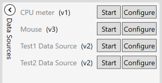

To be able to visualize a signal from a data source, you first have to start it. On the screen shot above, you can see that all sources are stopped. When started, the name of the data source appears in blue.

Also there is a `Configure` button beside the `Start` button, this is for data sources that are configurable. If a data source is not configurable, the `Configure` button still appears, but nothing happens when clicked.

Have a look at `Fourier` data source for a configurable one.

Then, at the bottom right of the window, click the `Add Group` button to add a group of horizontally layed out signal views.

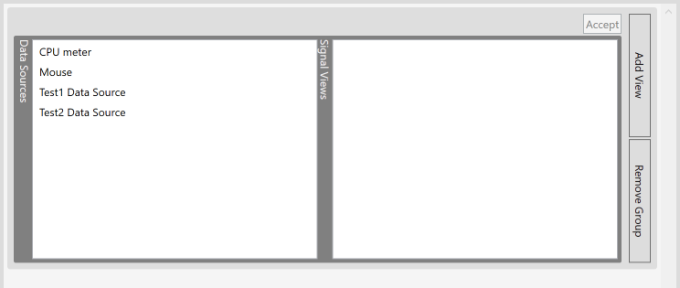

Note that the `Accept` button at top right of the group box is grayed out, because the signal view has not been fully chosen.

There are also two other buttons, `Add View` which adds another view to the current group, and `Remove Group` which removes the whole group.

Once the data source and the signal view has been fully chosen, the `Accept` button gets enabled.

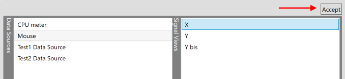

You can add another signal view to the current group by clicking the `Add View` button.

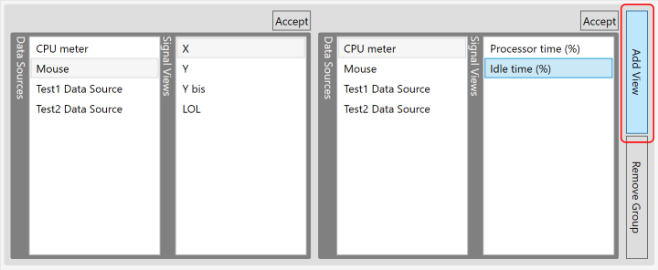

Then click the `Accept` button to validate the signal view and then finally being able to visualize the signal.

On each signal, you can open a settings pane to configure the sampling rate and values range.

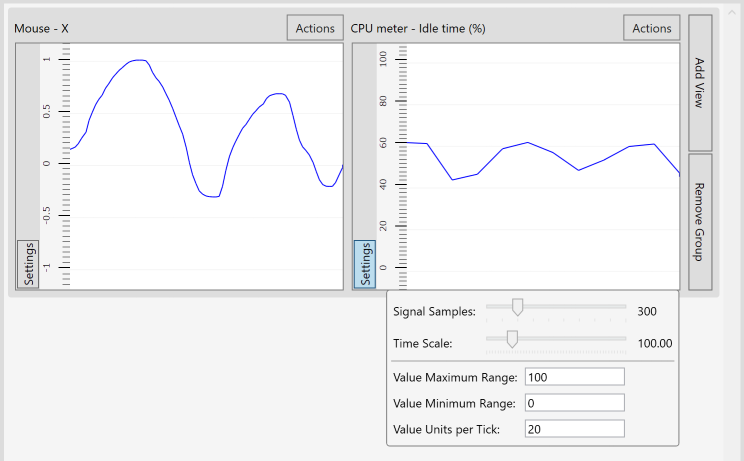

Here is how it looks like when there are several groups with several source selected and started.

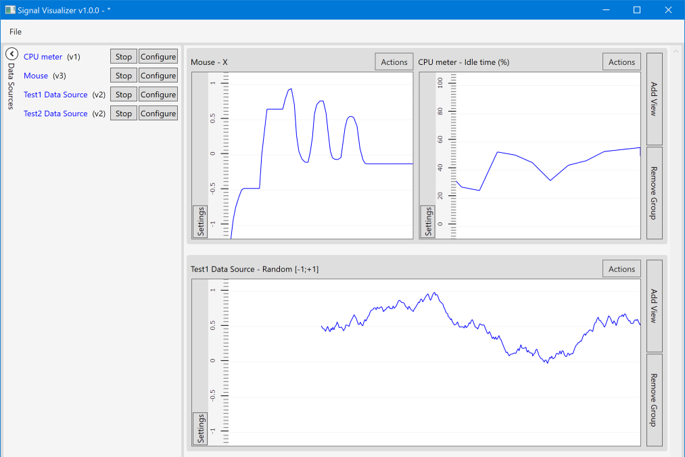

On signal view, you can perform some actions, such as:
- Changing to another data source and/or view
- Applying some filters
- Remove the signal view

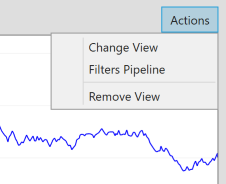

Changine the view brings you back to the previous data source and signal view selection panel, nothing new, removing the signal view removes the view from the group, letting other views unmodified.

Selecting `Filters Pipeline` takes you to another pane where you can add/remove one or more filters, change their order to construct a filter pipeline.

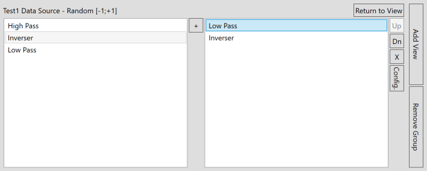

### Filters

The left pane (of the filter pipeline view after you selected a signal view) shows the available filters, provided by extension libraries. Selecting a filter allow you to click the `+` button in order to add the filter to the pipeline (right pane). Note that you can add the same filter several times if needed.

The right pane shows the filter instances. When you select a filter instance, the buttons on the right of the pane get activated, the `Up` button allow you to move the selected filter instance above the previous instance, the `Dn` (Down) button moves the filter instance bellow the next instance, the `X` button deletes the current instance, and eventually the `Config.` button allow you to configure the selected filter instance, if configuration is available. As for the data sources, the `Config.` button still appears even if the filter is not configurable, and clicking the button simply does nothing.

Filter instances are applyed in order of appearance in the list, from top to bottom. The first filter receives the raw signal input, then its output is passed to the input of the next filter (bellow one in the list), and so on, until the output of the last filter (bottom most of the list) is displayed on screen.

Clicking the `Return to View` button hides the filters pipeline pane and restore the signal view.

If a filter is configurable and you click the `Config.` button, a window should open for you to tweak some parameters. Bellow image shows the low-pass filter configuration window.

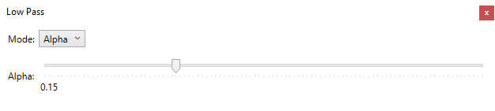

And then when the filter is applied to a signal, it displays as follow.
The bottom group shows the original filter and the top group shows the same signal with a low-pass filter applied.

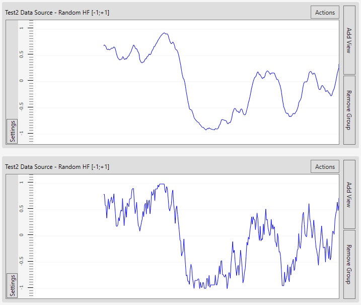

### Layout

Finally, you can save a layout, which is more like "setup" of data sources, signal views and filters.

In the `File` menu, you can click the `Save Layout` or `Save Layout As...` menus in order to save the current layout, including groups, signal views per group with their view settings, and all filters with their configuration. You can then restore a layout by clicking `File/Load Layout...`.

The menu `File/New Layout` clears all the workspace, asking you if you want to save before proceeding if you have unsaved modifications.

The same applies to the `File/Close` menu, if you have unsaved modifications, it asks you if you want to save, discard or cancel the operation.

The layouts are stored as XML format, you can tweak them manually though not recommended.

## Tutorials

### How to create a data source

**1) Create a new project**

This step is optional, but I advice you to read it anyway.

You can either create a new project, or reuse an existing project, since a project can contain several data source extensions.

If you decide to create a new project, you can create a simple class library, but it will be hard to add WPF components afterward if then you decide you need a UI for your extension, to graphically configure it for example.

Note that the `MouseDataSourceExtension` project is a simple class library since it does not require any graphical user interface.

If you need a UI for your extension, the best way to proceed is to create a new WPF Application project (yes, an **application**)

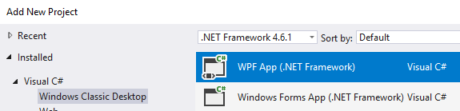

then remove the `App.config`, `App.xaml` (and `App.xaml.cs`) files.
You can keep the `MainWindow.xaml` (and `MainWindow.xaml.cs`) files since you may need them for a configuration window.

Then you have to change the type of project to a class library, and you are done.

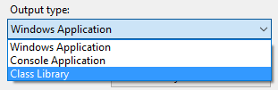

You should now see your WPF project to build as a library.

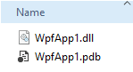

(Of course I recommend you to chose a name a bit more descriptive)

For this tutorial, I will use a simple class library that I name `CpuDataSource`.

You can also have a look at the project named `FourierDataSourceExtension` to see an example of how to create a data source with a configuration window and the underlying mechanisms.

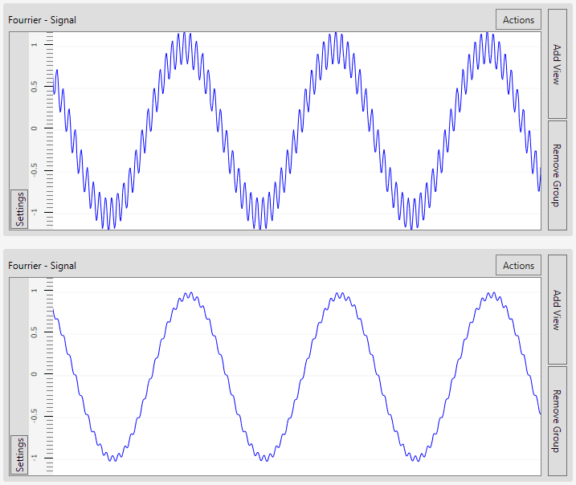

At top, this is the `Fourier` data source with the following configuration:

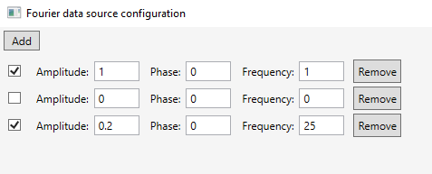

and bellow is the same signal with a low-pass filter applied with an alpha value of 0.14. See next section for filter creation tutorial.

**Note:** For projects shipped with SignalVisualizer, I added some extra post-build commands to output the library to SignalVisualizer output path.
This is because they are extensions, they are loosely coupled to SignalVisualizer, and thus not built when SignalVisualizer is built, and thus not not copied to SignalVisualizer output.

Here are the post-build commands:

```
mkdir "$(SolutionDir)$(SolutionName)\$(OutDir)Extensions" &
    copy "$(TargetPath)" "$(SolutionDir)$(SolutionName)\$(OutDir)Extensions\$(TargetFileName)"
```

I write the two commands on a single line because I like to use LF line ending format, and I encountered cases where two commands separated by a single LF were interpreted as a single command, and execution failed.

Thanks to the variables, the commands are generic enough to simply be copied/pasted from any other extenion project.

The final step of the project creation is to add required references.
You have to add `SignalVisualizer.Contracts` as a project reference, and `System.ComponentModel.Composition` (MEF) from the GAC assemblies.

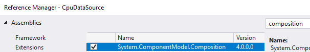

**2) Create a new class**

Or use the default class created with a new project.

You can start by adding the following usings:
- using SignalVisualizer.Contracts;
- using System.ComponentModel.Composition;

The namespace `System.ComponentModel.Composition` is an extensions composition library implemented by Microsoft, also known as MEF (Managed Extensibility Framework).
The namespace `SignalVisualizer.Contracts` is part of SignalVisualizer and hosts the base types you have to extend in order to interoperate with SignalVisualizer.

Then, make it inherit from `DateSourceBase`, and add the `[Export(typeof(IDataSource))]` attribute.

Your class should now look like this:

```CSharp
[Export(typeof(IDataSource))]
public class CpuMeterDataSource : DataSourceBase
{
}
```

Technically you can inherit from `IDataSource`, but you would have to reimplement the subscription mechanism, which is probably not how you want to spend your time.

Implement all the abstract methods (or let Visual Studio generates them for you) and implement them.

If I may give you an advice, prefer the readonly getter

```CSharp
public override string[] ComponentNames { get; } = ...
```

over the expression bodied getter

```CSharp
public override string[] ComponentNames => ...
```

because the former produces a backing field, and so executes the code `...` only once, set it to a backing field, and then returns the backing field each time the getter is accessed, whereas the expression bodied getter executes and returns the `...` code each time the getter is accessed, which can waste resources, espacially if you allocate memory or have to do a CPU intensive computation.

For reference, here is the decompiled code produced by the readonly getter:

```CSharp
private readonly string[] <ComponentNames>k__BackingField = new string[] { "Processor time (%)", "Idle time (%)" };

public override string[] ComponentNames
{
    [CompilerGenerated]
    get
    {
        return this.<ComponentNames>k__BackingField;
    }
}
```

versus the decompiled code produced by the expression bodied getter:

```CSharp
public override string[] ComponentNames
{
    get
    {
        return new string[]
        {
            "Processor time (%)",
            "Idle time (%)"
        };
    }
}
```

Eventually, here is the implementation of the `CpuMeterDataSource` class in the `CpuDataSource` library project.

```CSharp
[Export(typeof(IDataSource))]
public class CpuMeterDataSource : DataSourceBase
{
    public override string Name { get; } = "CPU meter";
    public override uint Version { get; } = 1;
    public override Guid UniqueIdentifier { get; } = new Guid("3c77228a-f646-4ce2-836b-d68e707f68a8");
    public override string[] ComponentNames { get; } = new string[] { "Processor time (%)", "Idle time (%)" };

    public override async Task Start(CancellationToken cancellationToken)
    {
        // allocates the storage for the values of the two components of the data source
        var values = new double[2];

        // create performance counters
        var totalCpu = new PerformanceCounter("Processor", "% Processor Time", "_Total", true);
        var currentProcessCpu = new PerformanceCounter("Processor", "% Idle Time", "_Total", true);

        // iterate while not cancelled
        while (cancellationToken.IsCancellationRequested == false)
        {
            // sample the performance counters values
            values[0] = totalCpu.NextValue();
            values[1] = currentProcessCpu.NextValue();

            // notify SignalVisualizer that a new value has been produced
            NotifyNext(values);

            // awaits to avoid burn out, then loop and restart
            await Task.Delay(250);
        }
    }
}
```

The common thing to do when implementing a data source, is looping while the received `CancellationToken` has not been cancelled.
We are in a micro-thread, so this is fine.

The next step is to compute (or retrieve from a physical source) the signal values. Note that the array of values is pre-allocated. Since produced values are consumed right away, there is not need to allocate an array on each loop iteration.

Then, notify SignalVisualizer that new values has been produced, by calling the `NotifyNext()` method. This is a protected method provided by the `DataSourceBase` base class we inherited from. This method is defined in the `IDataSource` interface that you must inherit from in the end, so even if at some point you decide to not inherit from `DataSourceBase` anymore but from your own base class, it will still be fine.

Eventually, yields some CPU time to SignalVisualizer by awaiting for an event, before the loop restarts over.

It is as simple as that.

**Note:** The number of elements in the array returned by the `ComponentNames` property and the `values` variable declared at top of the `Start` method must match. Otherwiise, your data source may produce an error at runtime.

From now on, you should have all the information you need to really build your own data source, and try it right away.

**Rembmer:** Do not forget to force a build of your project, otherwise it may not be built/copied to SignalVisualizer output path.

**3) The real life**

In real life, you will probably need more than a loop that produces random or local values for testing or academic purpose, but real field measurements.

I used to acquire gyroscope and accelerometer values from external devices through network, I wrote a small pieces of code that simply acquired data using the targeted platforms APIs, sending data over UDP, and so the SignalVisualizer extension was opening and binding a UDP socket in order to let devices to connect to it, and received data. I recommend UDP over TCP, unless of course if your priority is reliability over performances.

### How to create a filter

**1) Create a new project**

As for the creation of a data source extension, this step is optional if you already have a project that you want to reuse, because a single project can contain several extensions.

Read the same section of the `How to create a data source` tutorial for more information.

**2) Create a new class**

To create a filter, you need to create two classes, but you can put them both in the same file for simplicity. In this tutorial, I will assume we use a single file for the two classes. I will also refer to the `InverserFilter` because it is the most simple filter, which provides a good base to learn and get started.

The filters are created through a factory, and you also have to provide the factory. Actually, only the factory is an extension that SignalVisualizer will discover at runtime. The factory will be instanced only once, and the factory will be requested to instance filters for each signal, so filters can be stateful if needed.

You can start by adding the following usings:
- using SignalVisualizer.Contracts;
- using System.ComponentModel.Composition;

Then, make the first class inherit from `SignalFilterBase`. This class does not require any attribute.
Your class should now look like this:

```CSharp
internal class InverserFilter : SignalFilterBase
{
}
```

You can make it inherit from `ISignalFilter`, since the `SignalFilterBase` abstract class is just an helper one to spare you the storage of the factory and the necessity to implement abstract methods that you may not need.

Next step is to implement the filter class.

```CSharp
internal class InverserFilter : SignalFilterBase
{
    internal InverserFilter(ISignalFilterFactory signalFactory)
        : base(signalFactory)
    {
    }

    public override double ProcessValue(double time, double value) => -value;
}
```

The constructor is internal because it is preferable that only the factory is able to construct filters.
An even better practice would be the filter class to be a private class nested in the factory class, so only the factory class can instance it and publicly expose it through the ISignalFilter interface only.

Here, the things to note are:
- The constructor just forwards the factory to the base constructor
- the `ProcessValue` method simply returns the inversed input value
- other methods are not implemented since this filter requires no configuration at all

Then we have to implemt the factory class and we are done.

Create a new class, make it inherit from `ISignalFilterFactory`, and add the `[Export(typeof(ISignalFilterFactory))]` attribute.
No base class here because the interface very simple.

Your class should now look like this:

```CSharp
[Export(typeof(ISignalFilterFactory))]
public class InverserFilterFactory : ISignalFilterFactory
{
}
```

By convention, if a filter is named `Alice`, then your factory should be named `AliceFactory`, but naming is purely up to you and have no implication in the extension discovery process.

As for the data source extension, I recommend you to use readonly getters instead of expression bodied getters. Read the tutorial to create a data source for more information.

The `InverserFilterFactory` class is implemented as follow:

```CSharp
[Export(typeof(ISignalFilterFactory))]
public class InverserFilterFactory : ISignalFilterFactory
{
    public string FilterName { get; } = "Inverser";
    public Guid UniqueIdentifier { get; } = new Guid("12690ecb-c7fc-4f00-8ae6-7fcc1734601a");

    public ISignalFilter ProduceSignalFilter()
    {
        return new InverserFilter(this);
    }
}
```

Note that the `ProduceSignalFilter` method just instances an `InverserFilter` class and provides it the `this`, because a filter have to back-reference its factory.

Having the filter a private class nested in its factory also helps you prevent to instance a filter and make it back-reference the wrong factory. Note that in the current implementation, the filter class and its constructor are internal, which still does not prevent us to make a mistake.

You can have a look at the project `SignalVisualizer.DefaultExtensions` to see examples of how to create more advanced filters, such as low-pass and high-pass filters, as well as a configuration window for your filters.

Now you should be up and ready to implement your own filter and try it out right away.

## Future works

Things I would like to do it I have time someday or if SignalVisualizer gains some interest, are:

- Multiple signals per view
    - Currently a view in a group is composed of two panes, the data source on the left and the signal view on the right. This prevents from being able to select several signal view from different data sources. What is necessary is a view similar to the filters pipeline, and so the left pane have to be a tree of data sources with their signal views underneath. Being able to display several components of the same data source is feasible as is, but makes very few sense. Usually it is preferable to compare the same compoent of different data sources. For this feature, a huge rewrite of the view models is necessary.
- Change layout orientation
    - Currently the layout is hard-coded to vertically stacked groups or horizontally dispatched signal views. But why not wanting to horizontally stack groups of vertically dispatched signal views ? This is technically feasible as is, and actually I started to experiment on it, but it requires a lot of value converters logic, and I let this feature in idle since it is not critical.

## Have fun

It is funny to play with the `Fourier` data source to create strange signal shapes experimenting around with some funky values.

The `Fourier` data source is based on sine wave composition. You can find more information about sine waves here:
- Wikipedia: https://en.wikipedia.org/wiki/Sine_wave
- Eugene Khutoryansky: https://www.youtube.com/watch?v=r18Gi8lSkfM

Apply filters to produced signals for even more fun!

Hereafter are some well known signals, with their configuration and formula:

### Square signal

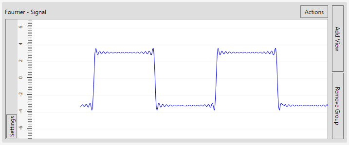

The configuration:

Amplitude | Frequency
----------|----------
4         | 1
4 / 3     | 3
4 / 5     | 5
4 / 7     | 7
4 / 9     | 9
...       | ...

You can input fractions in the configuration of the `Fourier` data source, as follow:

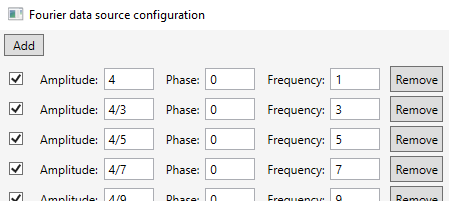

The amplitude is `4 / ((index * 2) + 1)` and the frequency is `(index * 2) + 1`.
The numerator of the amplitude doesn't have to `4`, you can chose any value you see fit. This will define the base amplitude of the output signal. Use `1` if you want the output signal to be in range `-1 ; +1`.
The phase remain to 0 for every sine waves.

This signal is often applied an [hysteresis](https://en.wikipedia.org/wiki/Hysteresis) filter to produce pure square signals.

More information on Wikipedia: https://en.wikipedia.org/wiki/Square_wave

Hereafter is an hysteresis filter applied to a sine wave to produce a perfect square signal.

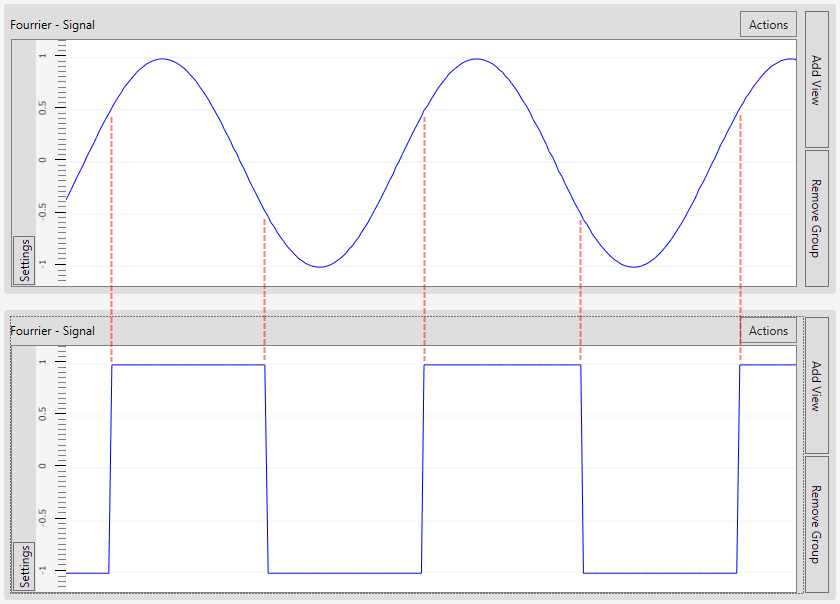

(Red dashed lines have been added to the screen shot to emphasize low and high triggers effect)

The settings of the filter are as follow:
- Max value: +1
- High trigger: +0.5
- Low trigger: -0.5
- Min value: -1

### Sawtooth signal

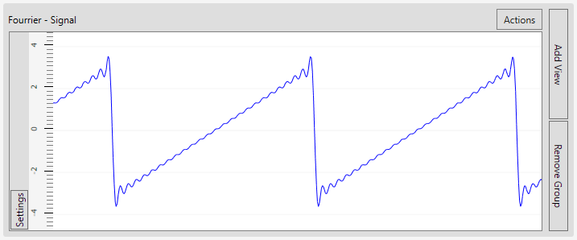

The configuration:

Amplitude | Frequency
----------|----------
+2 / 1    | 1
-2 / 2    | 2
+2 / 3    | 3
-2 / 4    | 4
+2 / 5    | 5
-2 / 6    | 6
+2 / 7    | 7
...       | ...

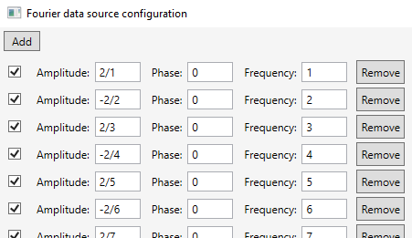

The amplitude is `((-1) ^ index) * 2) / (index + 1)`, or `(sign * 2) / (index + 1)` where sign is `+1` when index is even and `-1` when index is odd, and the frequency is `index + 1`.
The phase remain to 0 for every sine waves.

More information on Wikipedia: https://en.wikipedia.org/wiki/Sawtooth_wave

### Triangle signal

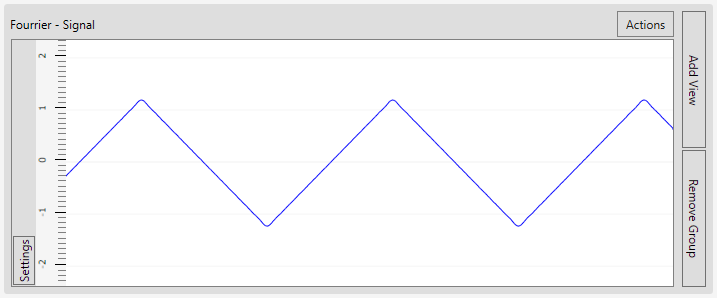

The configuration:

Amplitude | Frequency
----------|----------
+1 / 1    | 1
-1 / 9    | 3
+1 / 25   | 5
-1 / 49   | 7
+1 / 81   | 9
-1 / 121  | 11
+1 / 169  | 13
-1 / 225  | 15
...       | ...

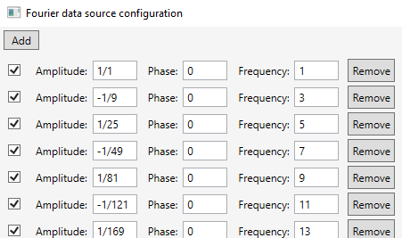

Here I will use a variable `k` to simplify, where `k` is `index + 1`.
The amplitude is `((-1) ^ index) / ((index * 2 + 1) ^ 2)`, or `sign / ((index * 2 + 1) ^ 2)` where sign is `+1` when index is even and `-1` when index is odd, and the frequency is `index * 2 + 1`.
The phase remain to 0 for every sine waves.

More information on Wikipedia: https://en.wikipedia.org/wiki/Triangle_wave
